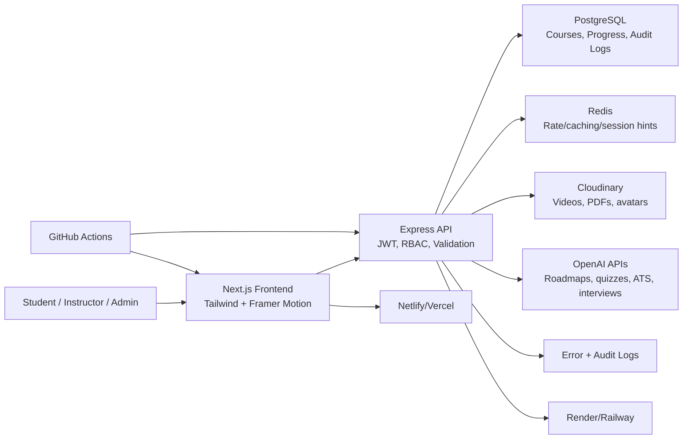
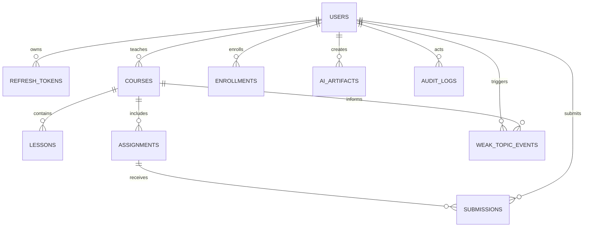

# LuminaPath AI

LuminaPath AI is an original AI-powered learning platform for students, instructors, and admins. It combines adaptive courses, career roadmaps, ATS resume analysis, AI mock interviews, voice-tutor workflows, collaborative study rooms, skill heatmaps, smart revision scheduling, and AI-generated flashcards.

This project uses the referenced ApexQuest repository only as feature inspiration. The architecture, folder structure, product identity, UI system, database model, and implementation are new.

## Project Identity

Generated name options:

1. LuminaPath AI
2. SkillHarbor
3. CortexTrail Academy
4. NovaMentor LMS
5. PathWise Learning

Selected brand: **LuminaPath AI**

Logo concept: an open horizon path crossing a luminous neural node, representing guided mastery with adaptive AI coaching.

Palette:

| Token | Hex |
| --- | --- |
| Ink | `#101828` |
| Cloud | `#f7fbff` |
| Aurora | `#19c7b7` |
| Ember | `#ff8a4c` |
| Violet | `#7161ef` |
| Night | `#09111f` |

## Architecture



## Monorepo Layout

```text
backend/         Express API, auth, AI workflows, tests, Dockerfile
frontend/        Next.js app router UI, design system, dashboards
database/        PostgreSQL migrations and seed scripts
docs/            Deployment and API notes
.github/         CI, issue templates, PR template
```

## Core Features

- Authentication: JWT access tokens, refresh tokens, RBAC, Google credential login, forgot password, email verification hooks.
- Student: dashboard, enrollment, progress, AI study planner, quiz generation, roadmap, assignments, feedback, weak topics, resume analysis, mock interviews, badges, streaks, notes/bookmarks, notifications.
- Instructor: course creation, upload-ready video/PDF surfaces, analytics, performance insights, assignment review.
- Admin: user management surfaces, course approval, platform/revenue analytics, moderation tools, audit logs.
- Differentiators: AI career roadmap generator, ATS analyzer, mock interview simulator, learning recommendation engine, voice tutor UI, collaborative study rooms, peer learning, skill heatmap, adaptive difficulty, revision scheduler, flashcards.

## Tech Stack

- Frontend: Next.js, TypeScript, TailwindCSS, Framer Motion, Recharts, Lucide icons.
- Backend: Node.js, Express.js, TypeScript, Zod validation.
- Data: PostgreSQL, Redis.
- Auth: JWT, refresh-token rotation storage, OAuth credential verification hooks.
- Storage: Cloudinary-ready backend config.
- AI: OpenAI API integration with deterministic local fallback.
- DevOps: Docker, Docker Compose, GitHub Actions CI.
- Testing: Jest and Supertest.

## Local Setup

```bash
npm install
cp .env.example .env
docker compose up -d postgres redis
npm run migrate --workspace backend
npm run seed --workspace backend
npm run dev
```

Frontend: [http://localhost:3000](http://localhost:3000)  
Backend: [http://localhost:8080/health](http://localhost:8080/health)

Demo credentials:

| Role | Email | Password |
| --- | --- | --- |
| Student | `student@luminapath.ai` | `Luminapath#2026` |
| Instructor | `instructor@luminapath.ai` | `Luminapath#2026` |
| Admin | `admin@luminapath.ai` | `Luminapath#2026` |

## Environment Variables

See [.env.example](./.env.example).

Important production values:

- `DATABASE_URL`
- `REDIS_URL`
- `JWT_ACCESS_SECRET`
- `JWT_REFRESH_SECRET`
- `CSRF_SECRET`
- `OPENAI_API_KEY`
- `GOOGLE_CLIENT_ID`
- `CLOUDINARY_CLOUD_NAME`
- `CLOUDINARY_API_KEY`
- `CLOUDINARY_API_SECRET`
- `FRONTEND_URL`
- `NEXT_PUBLIC_API_URL`

## API Overview

Base URL: `/api`

| Method | Route | Purpose |
| --- | --- | --- |
| `POST` | `/auth/register` | Create user and issue JWT session |
| `POST` | `/auth/login` | Password login |
| `POST` | `/auth/google` | Verify Google ID credential |
| `POST` | `/auth/refresh` | Refresh access token |
| `POST` | `/auth/forgot-password` | Queue password reset |
| `POST` | `/auth/verify-email` | Accept email verification token |
| `GET` | `/courses` | Course catalog |
| `POST` | `/courses` | Instructor/admin course creation |
| `POST` | `/courses/:courseId/enroll` | Student enrollment |
| `PATCH` | `/courses/:courseId/progress` | Progress tracking |
| `POST` | `/ai/:mode` | AI artifacts: planner, quiz, roadmap, ATS, interview, flashcards, recommendations |
| `GET` | `/platform/student/dashboard` | Student metrics |
| `GET` | `/platform/instructor/analytics` | Instructor metrics |
| `GET` | `/platform/admin/analytics` | Admin metrics |

## Database

The schema includes normalized tables for users, refresh tokens, courses, lessons, enrollments, lesson progress, assignments, submissions, AI artifacts, weak topic events, study rooms, and audit logs. Indexes target role filtering, course approval queues, lesson ordering, learner progress, submission review queues, weak topic lookups, AI artifact history, and audit investigations.

ER diagram:



## Security

- Helmet security headers
- CORS allowlist
- Rate limiting
- Input validation with Zod
- XSS sanitization
- HPP protection
- CSRF double-submit cookie
- Bcrypt password hashing
- JWT access/refresh tokens
- RBAC middleware
- Audit log schema for sensitive actions

## Performance

- Next.js app router with optimized production build
- Lazy client boundaries for animated/chart-heavy UI
- Tailwind utility CSS
- API response compression
- Redis-ready cache layer
- PostgreSQL indexes for hot paths
- Dockerized deployment parity
- SEO metadata and Open Graph tags

## Deployment

Frontend:

1. Create a Netlify or Vercel project from this repository.
2. Set root/base directory to `frontend`.
3. Set `NEXT_PUBLIC_API_URL` to the deployed backend URL plus `/api`.
4. Build command: `npm run build`

Backend:

1. Create a Render/Railway service from `backend/Dockerfile` or run `npm run build --workspace backend && npm run start --workspace backend`.
2. Provision PostgreSQL and Redis.
3. Configure environment variables from `.env.example`.
4. Run migrations and seed scripts.

Production verification checklist:

- Auth login, refresh, logout
- Google login with configured `GOOGLE_CLIENT_ID`
- AI workflows with `OPENAI_API_KEY`
- Upload credentials with Cloudinary env values
- Dashboard, analytics, and course approval routes
- CI green on check, test, and build

## Validation

```bash
npm run check --workspaces --if-present
npm test --workspaces --if-present
npm run build --workspaces --if-present
```

## Screenshots

Add screenshots from:

- `/`
- `/dashboard`
- `/courses`
- `/ai-lab`

The frontend is designed with a responsive SaaS dashboard layout, dark/light mode, glassmorphism surfaces, accessible icon buttons, dashboard cards, charts, and mobile-safe spacing.
