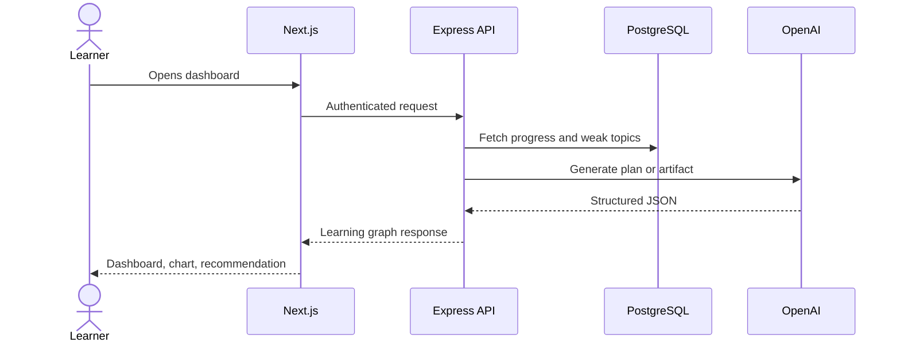

# Architecture Notes

LuminaPath AI uses a modular monorepo:

- `frontend`: Next.js app router, role dashboards, chart components, theme system.
- `backend`: Express API with typed middleware, JWT auth, OpenAI workflows, and catalog/platform routes.
- `database`: raw SQL migrations for predictable Postgres operations.

## Request Flow

## Scalability

- Stateless API containers scale horizontally.
- PostgreSQL owns durable learning records.
- Redis supports caching, session hints, and rate-limit coordination.
- Audit logs separate operational traceability from feature tables.
- AI artifact records enable history, observability, and evaluation.
